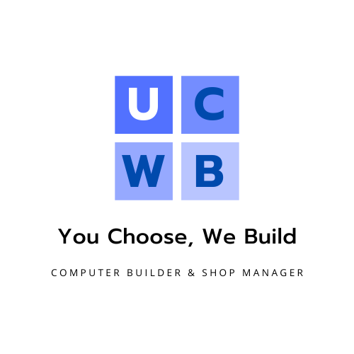

|University Project||
|----|----|

# YouChooseWeBuild-Project

**ITE-418 Final Project (Python 1/2564)**

## Development Tools
* **IDE :** `PyCharm Professional 2021.1.2 or newer`
* **Interpreter :** `Python 3.9`
* **GUI Framework :** `PyQt5 with Qt Designer`
* **DBaaS :** `MongoDB Atlas`
